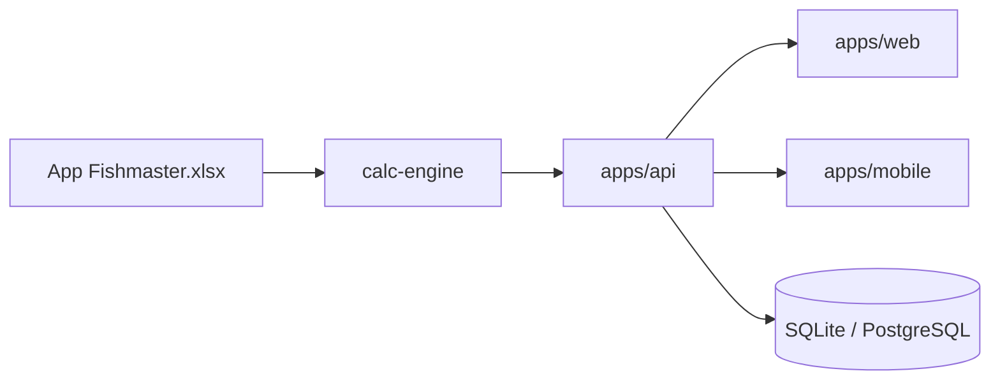

# Fishmaster Architecture

## Overview

Fishmaster is a **multi-tenant aquaculture platform**. Business logic lives in a standalone `calc-engine` package, tested against the Excel workbook specification.

## Calculation pipeline

1. **Registration inputs** — pond dimensions, stocking date, quantity, weight
2. **FCR coefficients** — monthly FCR, % body weight, feed size (from `FCR, %body Wt` sheet)
3. **Daily fish quantity** — mortality input → present stock
4. **Daily feed chart** — feed gift, morning/evening split, cumulative feed
5. **Monthly rollups** — 21 report outputs
6. **Homepage comparisons** — expected vs actual (under/overfeeding)

## Report mapping (21 app reports → engine outputs)

| # | Report | Engine source |
|---|--------|---------------|
| 1 | Advised feed size | `monthlyProjections[].feedSizeMm` |
| 2 | Advised stocking | `advisedStocking` |
| 3 | Cumulative feed bags | `monthlyProjections[].cumulativeFeedBags` |
| 4 | Cumulative feed kg + fish weight | `cumulativeFeedKg`, `expectedTotalWeightKg` |
| 5 | Cumulative mortality | `mortalitySummaries[].cumulativeMortality` |
| 6–7 | Cycle feed kg/bags | `cycleFeedKg`, `cycleFeedBags` |
| 8 | Monthly bags | `monthlyFeedBags` |
| 9–11 | Monthly avg/total weight, feed | `monthlyProjections` |
| 12 | Daily feed chart | `dailyFeedCharts` |
| 13 | Fish qty close of day | `fish-quantity` present qty |
| 14–21 | Monthly stock/mortality reports | `mortalitySummaries` |

## API endpoints (Phase 1)

| Method | Path | Purpose |
|--------|------|---------|
| GET | `/health` | Health check |
| POST | `/api/reports/stock-cycle` | Full calculation report |
| POST | `/api/alerts/feeding` | Under/overfeeding detection |
| GET | `/api/pond/day-in-cycle` | Culture day counter |

## Planned Phase 2

- NestJS migration with modules: `auth`, `farms`, `reports`, `billing`, `cms`
- PostgreSQL for production (SQLite for local dev)
- GPS farm directory, operations chart, water parameters
- Member photo uploads with admin approval
- Multi-species support, gamification

## Testing strategy

`calc-engine` tests validate engine output against Excel cached values (±5–15% tolerance during port; tighten over time).

## ADR-001: Calculation engine as standalone package

**Decision:** All Excel formulas live in `packages/calc-engine`, not in API routes or React components.

**Rationale:** Testability, reusability, single source of truth, CV-defensible separation of concerns.
